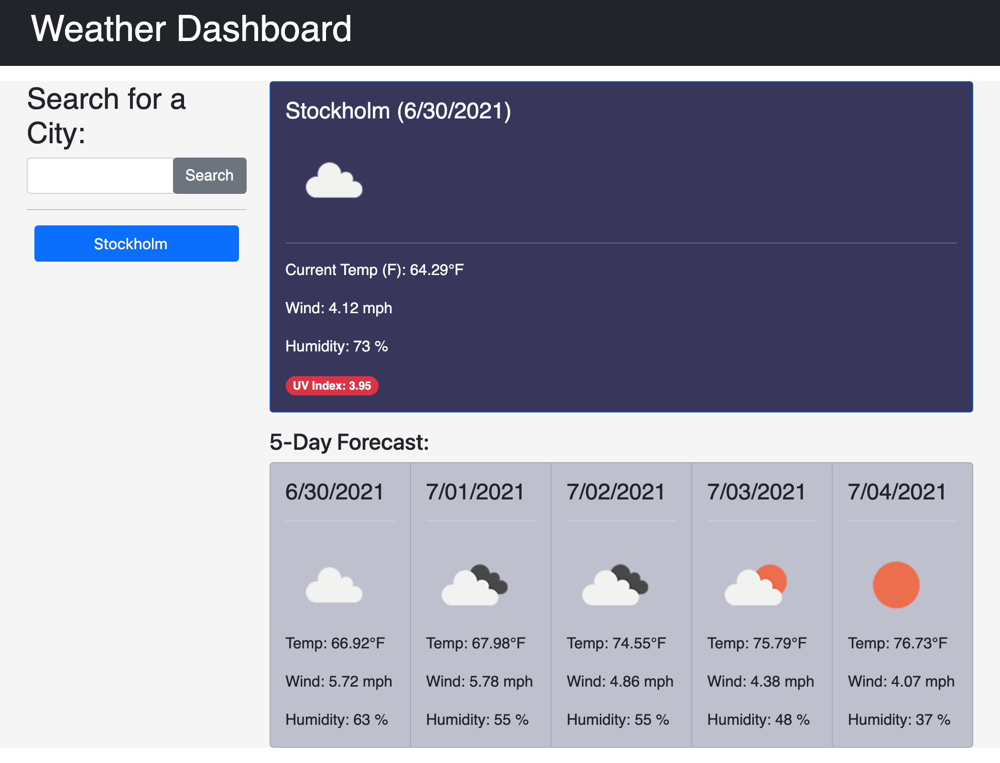

# weather-dashboard

## Description
- For this task, I wanted to take advantage of the open weather api and create a useful weather dashboard. By using this server-side api, I was able to gather information about the weather for multiple cities. 
- I built this weather dashboard to gain a better understanding of the use of server-side api's and how to navigate through their information. I was able to get practice with using fetch and inserting parameters into URLs.
- This task helped me gain addition experience and practice with not only server side api's, but as well as JavaScript, jQuery, and HTML. 
- This weather dashboard helped me realize how useful a server-side api can be when creating an application. I was also able to understand the importance of debugging code and making sure everything has a failsafe.

## Webpage

## Link
https://vivicowan.github.io/weather-dashboard/